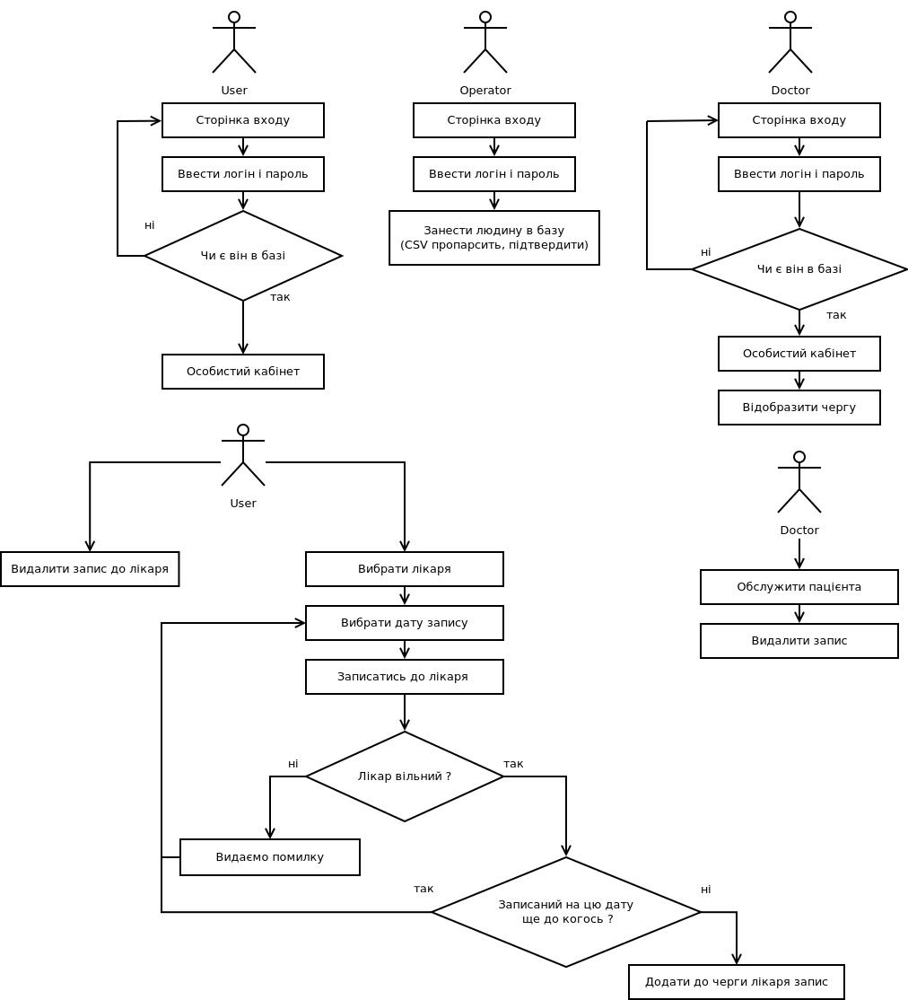

# Workflow diagram

# Basic description
## User
1. Повертаємо сторінку для входу.
2. Входить.
3. Пвертається особистий кабінет з чергою (таблиця чи список з записами цього користувача)  та особистою інформацєю користувача.
4. Кристувач має можливість перейти до сторінки запису до лікаря, видалити запис з списку.
5. При виборі лікаря вибирається дата запису, якщо вона вільна в лікаря  і користувач не записаний на цю дату ще до когось,  запис додається до черги користувача та лікаря.

## Doctor 
1. Повертаємо сторінку для входу.
2. Входить.
3. Пвертається сторніка з чергою лікаря.
4. Лікар має можливість перейти до сторінки обслуговування пацієнта в черзі.
5. По закінченню сеансу з пацієнтом видалити з черги користувача та лікаря  запис про сеанс. (запис про відвідини залишається в базі протягмо 30 днів)

## Admin
1. Повертаємо сторінку для входу.
2. Входить.
3. Повертається сторінка адміна.
4. Має можливість додавати/видаляти лікарів,  користувачів, імпортувати користувачів з CSV.

---
* Всі ма ють можливість вийти з системи.